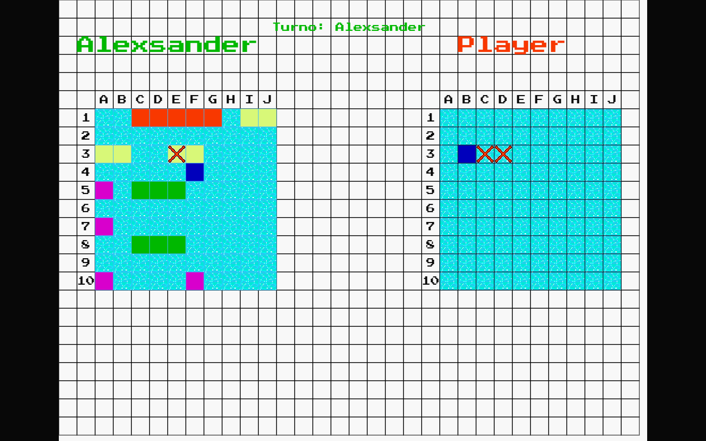
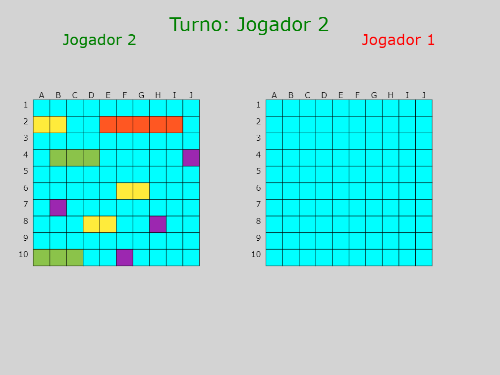
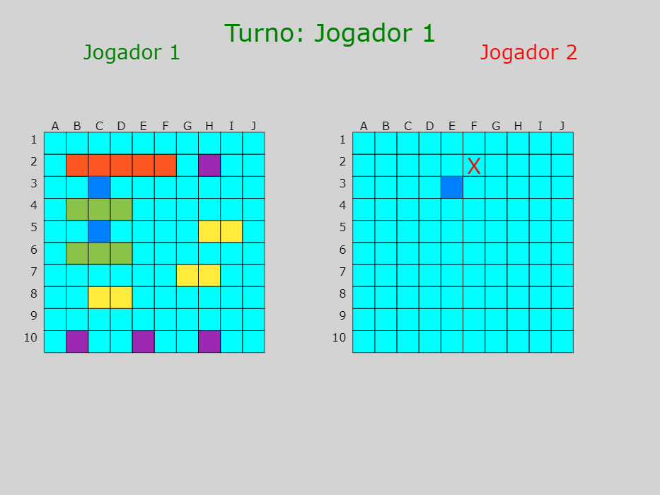

# Batalha-Naval-Multiplayer

## Tecnologias

 - HTML5
 - Javascript
 - CSS3
 - Node JS
 - Socket IO

## Capturas de tela








## Rodando localmente
 
 ```bash
git clone https://github.com/Alex5ander/Batalha-Naval-Multiplayer.git
 ```

### Entre no diretório do projeto
 ```bash
cd Batalha-Naval-Multiplayer
 ```

 ### Instale as dependências
 ```bash
 npm i

 ```

 ### Inicie o servidor
 ```bash
 npm start 
 ```